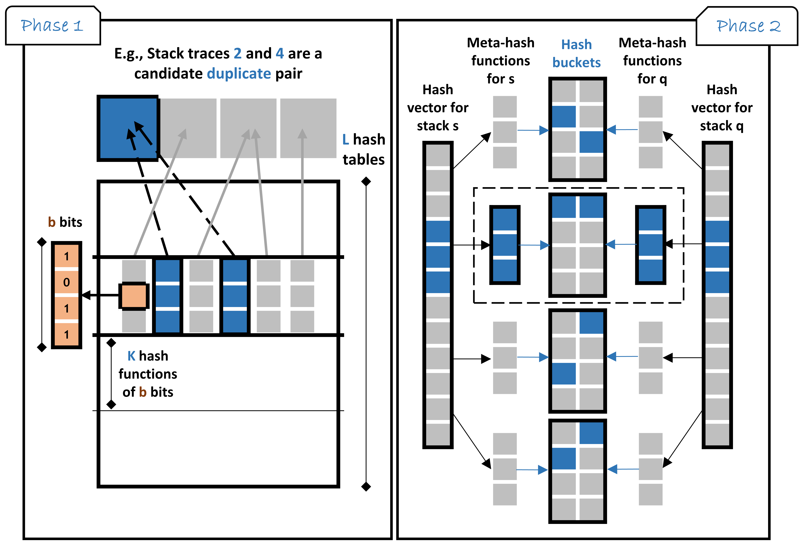

# DeepLSH: Deep Locality-Sensitive Hash Learning for Fast and Efficient Near-Duplicate Crash Report Detection

## Overview
Automatic crash bucketing is a critical step in the software development process to efficiently analyze and triage bug reports. In this work, we aim at detecting for a crash report its candidate near-duplicates (i.e., similar crashes that are likely to be induced by the same software bug) in a large database of historical crashes and given any similarity measure dedicated to compare between stack traces. To this end, we propose **DeepLSH** a deep Siamese hash coding neural network based on Locality-Sensitive Hashing (LSH) property in order to provide binary hash codes aiming to locate the most similar stack traces into hash buckets. **DeepLSH** have been conducted on a large stack trace dataset and performed on state-of-the-art similarity measures proposed to tackle the crash deduplication problem:
- Jaccard coefficient [[Ref](https://en.wikipedia.org/wiki/Jaccard_index)]
- Cosine similarity [[Ref](https://en.wikipedia.org/wiki/Sine_and_cosine)]
- Lucene TF-IDF [[Ref](https://lucene.apache.org/core/7_6_0/core/org/apache/lucene/search/similarities/TFIDFSimilarity.html)]
- Edit distance [[Ref](https://en.wikipedia.org/wiki/Edit_distance)]
- Brodie et al. [[Paper](https://www.cs.drexel.edu/~spiros/teaching/CS576/papers/Brodie_ICAC05.pdf)]
- PDM-Rebucket [[Paper](https://www.researchgate.net/publication/254041628_ReBucket_A_method_for_clustering_duplicate_crash_reports_based_on_call_stack_similarity)]
- DURFEX [[Paper](https://users.encs.concordia.ca/~abdelw/papers/QRS17-Durfex.pdf)]
- Lerch and Mezini [[Paper](https://files.inria.fr/sachaproject/htdocs//lerch2013.pdf)]
- Moroo et al. [[Paper](http://ksiresearch.org/seke/seke17paper/seke17paper_135.pdf)]
- TraceSIM [[Paper](https://arxiv.org/pdf/2009.12590.pdf)]

## Contributions

Our contribution is three-fold. 
- Aiming to overcome the problem of deriving LSH functions for stack-trace similarity measures, we propose a generic approach dubbed DeepLSH that learns and provides a family of binary hash functions that perfectly approximate the locality-sensitive property to retrieve efficiently and rapidly near-duplicate stack traces. 



- Technically, we design a deep Siamese neural network architecture to perform end-to-end hashing with an original objective loss function based on the locality-sensitive property preserving with appropriate regularizations to cope with the binarization problem of optimizing non-smooth loss functions. 
- We demonstrate through our experimental study the effectiveness and scalability of DeepLSH to yield near-duplicate crash reports under a dozen of similarity metrics. We successfully compare to standard LSH techniques (MinHash and SimHash), and the most relevant deep hashing baselineon a large real-world dataset that we make available.


## How to use this code?
1. Clone this repository using: ```git clone https://github.com/anony2023/DeepLSH.git ```
2. Install the required python packages: ```pip install -r ./code/requirements.txt ```
3. Run the notebooks in code/notebooks/measure:
    * measure-DeepLSH.ipynb : the end-to-end procedure to train/test and validate DeepLSH
    * measure-Baseline.ipynb: the end-to-end procedure to train/test and validate the CNHH+LSH baseline
    * measure-MinHash.ipynb (for Jaccard [boW / N-grams]): the end-to-end procedure to run MinHash
    * measure-SimHash.ipynb (for Cosine [boW / N-grams / TF-IDF]): the end-to-end procedure to run SimHash
    * measure-Runtime.ipynb : comparison between the required runtime for DeepLSH vs. CNNH+LSH vs. KNN-based approach

